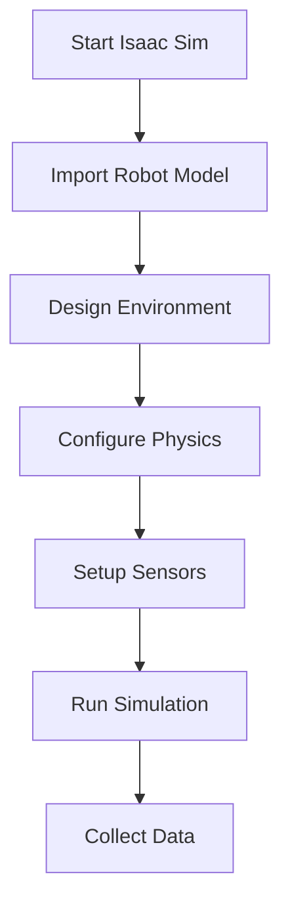

import Layout from '@theme/Layout';
import { useState } from 'react';

# Isaac Sim: Photorealistic Simulation and Synthetic Data Generation

This module covers NVIDIA Isaac Sim for creating photorealistic simulation environments and generating synthetic datasets for training perception models.

## Overview

Isaac Sim is NVIDIA's robotics simulator built on the Omniverse platform. It provides:

- Photorealistic rendering capabilities
- Physics simulation with PhysX engine
- Synthetic data generation tools
- Integration with ROS 2 for robotics workflows
- USD (Universal Scene Description) format support

## Learning Objectives

By the end of this chapter, you will be able to:

1. Set up an Isaac Sim environment
2. Create photorealistic scenes with realistic lighting and materials
3. Configure sensors for data collection
4. Generate synthetic datasets for perception training
5. Export data in standard formats

## Table of Contents

1. [Isaac Sim Architecture](#isaac-sim-architecture)
2. [Scene Creation Workflow](#scene-creation-workflow)
3. [Sensor Configuration](#sensor-configuration)
4. [Synthetic Data Generation](#synthetic-data-generation)
5. [Dataset Export](#dataset-export)
6. [Best Practices](#best-practices)

## Isaac Sim Architecture

Isaac Sim leverages NVIDIA's Omniverse platform to provide a powerful simulation environment for robotics. The architecture includes:

- **USD Scene Format**: Universal Scene Description for 3D scenes
- **PhysX Physics Engine**: Realistic physics simulation
- **RTX Rendering**: Photorealistic rendering with ray tracing
- **ROS 2 Bridge**: Communication with ROS 2 ecosystem
- **Synthetic Data Tools**: Depth, segmentation, bounding box generation

## Scene Creation Workflow

To create a scene in Isaac Sim:

1. Launch Isaac Sim
2. Create or import a robot model (URDF format)
3. Design the environment with objects and lighting
4. Configure physics properties
5. Set up sensors for data collection



## Sensor Configuration

Isaac Sim supports various sensor types:

- RGB cameras
- Depth sensors
- LiDAR sensors
- IMU sensors
- Force/torque sensors

Each sensor can be configured with specific parameters for your use case.

## Synthetic Data Generation

The synthetic data generation pipeline includes:

- **Depth Maps**: Per-pixel depth information
- **Semantic Segmentation**: Pixel-level object classification
- **Instance Segmentation**: Pixel-level object instance identification
- **Bounding Boxes**: 2D and 3D object bounding boxes
- **Normals**: Surface normal vectors

## Dataset Export

Isaac Sim can export datasets in multiple formats:

- COCO format for object detection
- KITTI format for autonomous driving
- Custom formats for specific applications

## Best Practices

1. Use realistic lighting conditions
2. Include diverse environmental scenarios
3. Validate synthetic data quality
4. Document your simulation parameters
5. Test sim-to-real transfer capabilities

## Summary

Isaac Sim provides a powerful platform for creating realistic simulation environments and generating synthetic datasets for robotics perception tasks. By following the workflows outlined in this chapter, you can create high-quality training data for your perception models.

## Isaac Sim Workflow Diagram

<figure>
  
  <figcaption>Isaac Sim workflow from launching the simulator to exporting synthetic datasets</figcaption>
</figure>

## Runnable Isaac Sim Examples

### Example 1: Basic Scene Setup

```python
import omni
from omni.isaac.kit import SimulationApp

# Initialize Isaac Sim
config = {
    'headless': False,
    'enable_cameras': True
}
simulation_app = SimulationApp(config)

# Import required modules
from omni.isaac.core import World
from omni.isaac.core.utils.stage import add_reference_to_stage
from omni.isaac.core.utils.prims import set_targets

# Create world instance
world = World(stage_units_in_meters=1.0)

# Add robot to the scene
add_reference_to_stage(
    usd_path="path/to/robot_model.usd",
    prim_path="/World/Robot"
)

# Add environment objects
import omni.isaac.core.objects as objects
ground_plane = world.scene.add(
    objects.GroundPlane(
        prim_path="/World/ground",
        name="ground_plane",
        size=15.0,
        color=np.array([0.2, 0.2, 0.2])
    )
)

# Setup sensors
from omni.isaac.sensor import Camera
camera = Camera(
    prim_path="/World/Robot/camera",
    frequency=30,
    resolution=(1920, 1080)
)

# Run simulation
for i in range(1000):
    world.step(render=True)
    if i % 100 == 0:
        print(f"Simulation step: {i}")

# Close simulation
simulation_app.close()
```

### Example 2: Synthetic Data Generation

```python
import numpy as np
from PIL import Image
import cv2

def generate_synthetic_data():
    """
    Generate synthetic RGB, depth, and segmentation data
    """
    # Simulate RGB image
    rgb_image = np.random.randint(0, 255, (1080, 1920, 3), dtype=np.uint8)

    # Simulate depth image (in mm)
    depth_image = np.random.uniform(1000, 10000, (1080, 1080))  # mm

    # Simulate segmentation image
    seg_image = np.random.randint(0, 6, (1080, 1080), dtype=np.uint8)

    # Save images
    Image.fromarray(rgb_image).save("synthetic_rgb.png")
    Image.fromarray(depth_image.astype(np.uint16)).save("synthetic_depth.png")
    Image.fromarray(seg_image).save("synthetic_segmentation.png")

    print("Synthetic data generated successfully!")

if __name__ == "__main__":
    generate_synthetic_data()
```

### Example 3: Dataset Export Script

The dataset export script provided in the examples directory demonstrates how to process and export synthetic data in standard formats:

```bash
python dataset_export_script.py --input_dir /path/to/isaac_sim_output --output_dir /path/to/dataset --format coco
```