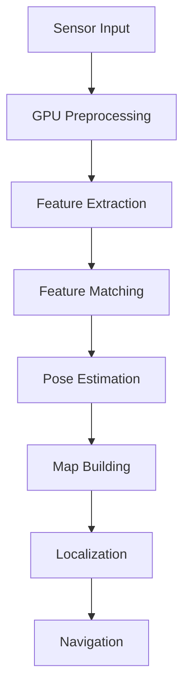

import Layout from '@theme/Layout';
import { useState } from 'react';

# Isaac ROS: GPU-Accelerated VSLAM and Navigation

This module covers NVIDIA Isaac ROS packages for performing GPU-accelerated Visual Simultaneous Localization and Mapping (VSLAM) and navigation in both simulated and real-world environments.

## Overview

Isaac ROS provides GPU-accelerated computer vision and perception packages optimized for NVIDIA hardware. Key features include:

- GPU-accelerated Visual SLAM
- Stereo depth estimation
- Sensor processing pipelines
- Integration with ROS 2 ecosystem
- CUDA-based processing nodes

## Learning Objectives

By the end of this chapter, you will be able to:

1. Set up Isaac ROS VSLAM pipeline
2. Process sensor data using GPU acceleration
3. Create accurate 2D/3D maps
4. Perform real-time localization
5. Execute autonomous navigation

## Table of Contents

1. [Isaac ROS Architecture](#isaac-ros-architecture)
2. [VSLAM Pipeline Setup](#vslam-pipeline-setup)
3. [GPU-Accelerated Processing](#gpu-accelerated-processing)
4. [Map Creation](#map-creation)
5. [Navigation Integration](#navigation-integration)
6. [Performance Optimization](#performance-optimization)

## Isaac ROS Architecture

Isaac ROS is built on top of ROS 2 and leverages NVIDIA's GPU computing capabilities:

- **CUDA Acceleration**: GPU-accelerated processing
- **Stereo Processing**: GPU-accelerated stereo depth estimation
- **Visual SLAM**: GPU-accelerated pose estimation
- **Sensor Bridge**: Integration with Isaac Sim and real sensors
- **ROS 2 Compatibility**: Full ROS 2 ecosystem support

## VSLAM Pipeline Setup

The Isaac ROS VSLAM pipeline consists of:

1. Sensor data input (cameras, IMU)
2. GPU-accelerated preprocessing
3. Feature extraction and matching
4. Pose estimation
5. Map building
6. Localization



## GPU-Accelerated Processing

Isaac ROS leverages CUDA cores for:

- Stereo depth computation
- Feature detection and matching
- Bundle adjustment
- Loop closure detection
- Map optimization

## Map Creation

The mapping process includes:

- **2D Occupancy Grids**: Traditional navigation maps
- **3D Point Clouds**: Dense geometric representation
- **Semantic Maps**: Object-labeled environments
- **Topological Maps**: Waypoint-based navigation

## Navigation Integration

Isaac ROS integrates with Nav2 for navigation:

- Waypoint following
- Path planning
- Obstacle avoidance
- Dynamic reconfiguration
- Behavior trees

## Performance Optimization

To optimize Isaac ROS performance:

1. Use appropriate GPU hardware (RTX series recommended)
2. Optimize sensor data rates
3. Configure pipeline parameters for your use case
4. Monitor GPU utilization
5. Validate real-time performance

## Summary

Isaac ROS provides powerful GPU-accelerated perception capabilities that bridge the gap between simulation and real-world robotics. By leveraging CUDA cores, it achieves real-time performance for demanding perception tasks.

## VSLAM Pipeline Diagram

<figure>
  
  <figcaption>Isaac ROS VSLAM pipeline showing GPU-accelerated processing from sensors to navigation outputs</figcaption>
</figure>

## Runnable Isaac ROS Examples

### Example 1: Basic VSLAM Pipeline

```python
#!/usr/bin/env python3
"""
Basic Isaac ROS VSLAM Pipeline Example
"""

import rclpy
from rclpy.node import Node
from sensor_msgs.msg import Image, CameraInfo, Imu
from geometry_msgs.msg import PoseStamped
from nav_msgs.msg import Odometry
import cv2
from cv_bridge import CvBridge
import numpy as np


class IsaacROSVisualSLAMNode(Node):
    """
    Isaac ROS Visual SLAM Node
    Demonstrates GPU-accelerated Visual SLAM using Isaac ROS packages
    """

    def __init__(self):
        super().__init__('isaac_ros_vslam_node')

        # Parameters
        self.declare_parameter('use_gpu', True)
        self.declare_parameter('max_features', 1000)
        self.declare_parameter('feature_threshold', 20)

        self.use_gpu = self.get_parameter('use_gpu').value
        self.max_features = self.get_parameter('max_features').value
        self.feature_threshold = self.get_parameter('feature_threshold').value

        # CV Bridge for image conversion
        self.bridge = CvBridge()

        # Subscribers
        self.image_sub = self.create_subscription(
            Image,
            '/camera/color/image_raw',
            self.image_callback,
            10
        )

        self.camera_info_sub = self.create_subscription(
            CameraInfo,
            '/camera/color/camera_info',
            self.camera_info_callback,
            10
        )

        self.imu_sub = self.create_subscription(
            Imu,
            '/imu/data',
            self.imu_callback,
            10
        )

        # Publishers
        self.odom_pub = self.create_publisher(Odometry, '/visual_slam/odometry', 10)
        self.pose_pub = self.create_publisher(PoseStamped, '/visual_slam/pose', 10)

        # Internal state
        self.camera_matrix = None
        self.position = np.array([0.0, 0.0, 0.0])
        self.orientation = np.array([0.0, 0.0, 0.0, 1.0])  # quaternion

        self.get_logger().info("Isaac ROS Visual SLAM node initialized")

    def image_callback(self, msg):
        """Process incoming image messages"""
        try:
            # Convert ROS Image to OpenCV
            cv_image = self.bridge.imgmsg_to_cv2(msg, desired_encoding='bgr8')

            # In a real implementation, you would perform VSLAM processing here
            # This is a simplified example
            self.get_logger().info(f"Received image: {cv_image.shape}")

        except Exception as e:
            self.get_logger().error(f"Error processing image: {str(e)}")

    def camera_info_callback(self, msg):
        """Process camera info messages"""
        self.camera_matrix = np.array(msg.k).reshape(3, 3)

    def imu_callback(self, msg):
        """Process IMU messages for sensor fusion"""
        # Extract orientation from IMU
        self.orientation[0] = msg.orientation.x
        self.orientation[1] = msg.orientation.y
        self.orientation[2] = msg.orientation.z
        self.orientation[3] = msg.orientation.w

    def publish_odometry(self):
        """Publish odometry information"""
        odom_msg = Odometry()
        odom_msg.header.stamp = self.get_clock().now().to_msg()
        odom_msg.header.frame_id = 'map'
        odom_msg.child_frame_id = 'camera'

        # Position
        odom_msg.pose.pose.position.x = float(self.position[0])
        odom_msg.pose.pose.position.y = float(self.position[1])
        odom_msg.pose.pose.position.z = float(self.position[2])

        # Orientation
        odom_msg.pose.pose.orientation.x = float(self.orientation[0])
        odom_msg.pose.pose.orientation.y = float(self.orientation[1])
        odom_msg.pose.pose.orientation.z = float(self.orientation[2])
        odom_msg.pose.pose.orientation.w = float(self.orientation[3])

        # Publish
        self.odom_pub.publish(odom_msg)

        # Also publish as PoseStamped
        pose_msg = PoseStamped()
        pose_msg.header = odom_msg.header
        pose_msg.pose = odom_msg.pose.pose
        self.pose_pub.publish(pose_msg)


def main(args=None):
    rclpy.init(args=args)

    vslam_node = IsaacROSVisualSLAMNode()

    try:
        rclpy.spin(vslam_node)
    except KeyboardInterrupt:
        pass
    finally:
        vslam_node.destroy_node()
        rclpy.shutdown()


if __name__ == '__main__':
    main()
```

### Example 2: Launch File for Isaac ROS VSLAM

Create a launch file to bring up the complete VSLAM pipeline:

```xml
<launch>
  <!-- Isaac ROS Visual SLAM Node -->
  <node pkg="isaac_ros_examples" exec="vslam_pipeline.py" name="isaac_ros_vslam" output="screen">
    <param name="use_gpu" value="True"/>
    <param name="max_features" value="1000"/>
    <param name="feature_threshold" value="20"/>
  </node>

  <!-- Isaac ROS Camera Driver -->
  <node pkg="isaac_ros_examples" exec="camera_driver.py" name="camera_driver" output="screen">
    <param name="camera_topic" value="/camera/color/image_raw"/>
    <param name="camera_info_topic" value="/camera/color/camera_info"/>
  </node>

  <!-- TF Publisher -->
  <node pkg="tf2_ros" exec="static_transform_publisher" name="camera_broadcaster" args="0.2 0.0 0.8 0.0 0.0 0.0 1.0 base_footprint camera"/>
</launch>
```

### Example 3: Isaac ROS to Nav2 Integration

Configuration file to integrate Isaac ROS outputs with Nav2:

```yaml
# Isaac ROS to Nav2 Integration Configuration
isaac_ros_vslam:
  ros__parameters:
    input_image_topic: "/camera/color/image_raw"
    input_camera_info_topic: "/camera/color/camera_info"
    input_imu_topic: "/imu/data"
    output_pose_topic: "/visual_slam/pose"
    output_odometry_topic: "/visual_slam/odometry"
    output_map_topic: "/visual_slam/map"
    use_gpu: true
    gpu_id: 0
    image_width: 1920
    image_height: 1080
    fps: 30
```