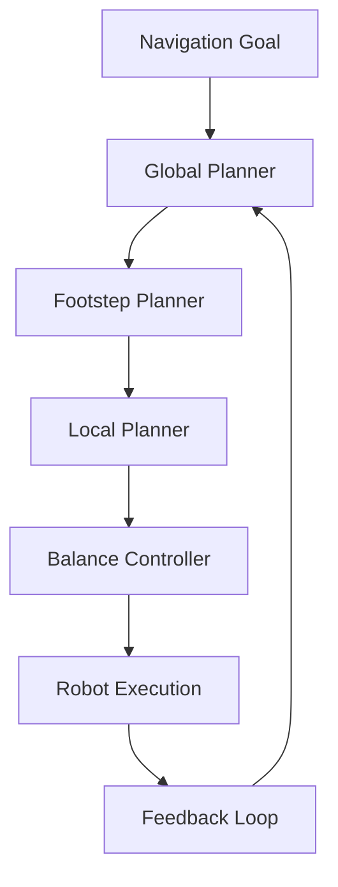

import Layout from '@theme/Layout';
import { useState } from 'react';

# Nav2: Path-Planning for Humanoid Robots

This module covers Navigation2 (Nav2) for path-planning specifically adapted for humanoid robots, including planning paths that consider unique kinematic constraints and balance requirements of bipedal locomotion.

## Overview

Navigation2 (Nav2) is the standard navigation framework for ROS 2, adapted for humanoid robots with:

- Humanoid-specific kinematic constraints
- Balance-aware path planning
- Footstep planning capabilities
- Bipedal locomotion support
- Integration with perception systems

## Learning Objectives

By the end of this chapter, you will be able to:

1. Configure Nav2 for humanoid robot kinematics
2. Set up humanoid-specific navigation parameters
3. Plan paths considering balance constraints
4. Execute navigation with bipedal locomotion
5. Integrate with perception and mapping systems

## Table of Contents

1. [Humanoid Navigation Challenges](#humanoid-navigation-challenges)
2. [Nav2 Architecture for Humanoids](#nav2-architecture-for-humanoids)
3. [Configuration Setup](#configuration-setup)
4. [Footstep Planning](#footstep-planning)
5. [Path Execution](#path-execution)
6. [Integration with Perception](#integration-with-perception)

## Humanoid Navigation Challenges

Humanoid robots face unique navigation challenges:

- **Balance Requirements**: Maintaining stability during movement
- **Kinematic Constraints**: Limited joint ranges and configurations
- **Footstep Planning**: Planning where to place feet for stable walking
- **Dynamic Stability**: Managing center of mass during locomotion
- **Terrain Adaptation**: Handling uneven surfaces and obstacles

## Nav2 Architecture for Humanoids

The humanoid Nav2 architecture includes:

- **Global Planner**: Path planning with kinematic constraints
- **Local Planner**: Trajectory generation for bipedal locomotion
- **Footstep Planner**: Planning foot placement for stable walking
- **Controller**: Balance control during navigation
- **Costmap**: Humanoid-aware obstacle avoidance



## Configuration Setup

Humanoid Nav2 configuration requires:

- **Kinematic Model**: Robot joint limits and constraints
- **Balance Parameters**: Center of mass and stability margins
- **Footprint**: Humanoid collision geometry
- **Controller Parameters**: Balance control settings
- **Costmap Settings**: Humanoid-aware obstacle inflation

## Footstep Planning

Footstep planning for humanoid navigation:

- Plans stable foot placements
- Considers terrain geometry
- Maintains balance throughout motion
- Accounts for robot kinematics
- Generates executable step sequences

## Path Execution

Executing humanoid navigation paths:

- Follows planned footstep sequences
- Maintains balance during movement
- Handles dynamic obstacle avoidance
- Adjusts for terrain variations
- Monitors stability metrics

## Integration with Perception

Nav2 integrates with perception systems:

- Uses maps from Isaac ROS VSLAM
- Incorporates real-time sensor data
- Handles dynamic obstacle detection
- Updates plans based on perception
- Maintains safe navigation

## Summary

Humanoid navigation requires specialized considerations for balance and kinematics. Nav2 provides the framework to handle these challenges while maintaining integration with the broader ROS 2 ecosystem and perception systems.

## Humanoid Navigation Diagram

<figure>
  
  <figcaption>Humanoid navigation system with Nav2, showing specialized components for balance and kinematic constraints</figcaption>
</figure>

## Runnable Nav2 Examples

### Example 1: Humanoid Path Planning

```python
#!/usr/bin/env python3
"""
Humanoid Path Planning Demo for Nav2
"""

import rclpy
from rclpy.node import Node
from geometry_msgs.msg import PoseStamped, Point
from nav_msgs.msg import Path
from visualization_msgs.msg import Marker, MarkerArray
from std_msgs.msg import Header
import numpy as np
import math


class HumanoidPathPlannerNode(Node):
    """
    Humanoid Path Planner Node
    Demonstrates Nav2 path planning adapted for humanoid robots
    """

    def __init__(self):
        super().__init__('humanoid_path_planner')

        # Parameters for humanoid-specific planning
        self.declare_parameter('robot_step_length', 0.3)  # meters
        self.declare_parameter('robot_step_height', 0.15)  # meters
        self.declare_parameter('robot_width', 0.4)  # meters
        self.declare_parameter('robot_height', 1.0)  # meters
        self.declare_parameter('balance_margin', 0.1)  # safety margin

        self.step_length = self.get_parameter('robot_step_length').value
        self.step_height = self.get_parameter('robot_step_height').value
        self.robot_width = self.get_parameter('robot_width').value
        self.robot_height = self.get_parameter('robot_height').value
        self.balance_margin = self.get_parameter('balance_margin').value

        # Publishers
        self.path_pub = self.create_publisher(Path, '/humanoid_plan', 10)
        self.footstep_pub = self.create_publisher(MarkerArray, '/footsteps', 10)
        self.balance_pub = self.create_publisher(Marker, '/balance_zone', 10)

        # Subscribers
        self.goal_sub = self.create_subscription(
            PoseStamped,
            '/goal_pose',
            self.goal_callback,
            10
        )

        self.get_logger().info("Humanoid Path Planner node initialized")

    def goal_callback(self, msg):
        """Process navigation goal and generate humanoid-aware path"""
        self.get_logger().info(f"Received goal: ({msg.pose.position.x}, {msg.pose.position.y})")

        # Generate path considering humanoid constraints
        path = self.generate_humanoid_path(msg.pose)

        # Publish the path
        self.path_pub.publish(path)

        # Generate footstep plan
        footsteps = self.generate_footsteps(path)

        # Publish footsteps visualization
        self.footstep_pub.publish(footsteps)

        # Publish balance zone visualization
        balance_zone = self.create_balance_zone(msg.pose)
        self.balance_pub.publish(balance_zone)

    def generate_humanoid_path(self, goal_pose):
        """Generate path considering humanoid kinematic constraints"""
        path = Path()
        path.header = Header()
        path.header.stamp = self.get_clock().now().to_msg()
        path.header.frame_id = 'map'

        # Start position (simplified)
        start_x, start_y = 0.0, 0.0
        goal_x, goal_y = goal_pose.position.x, goal_pose.position.y

        # Calculate path points with humanoid-specific constraints
        # For demonstration, create a simple straight-line path with intermediate waypoints
        # that respect step length limits
        distance = math.sqrt((goal_x - start_x)**2 + (goal_y - start_y)**2)
        num_waypoints = max(2, int(distance / self.step_length))

        for i in range(num_waypoints + 1):
            t = i / num_waypoints if num_waypoints > 0 else 0
            x = start_x + t * (goal_x - start_x)
            y = start_y + t * (goal_y - start_y)

            pose = PoseStamped()
            pose.header = path.header
            pose.pose.position.x = x
            pose.pose.position.y = y
            pose.pose.position.z = 0.0

            # Simple orientation toward goal
            yaw = math.atan2(goal_y - y, goal_x - x)
            pose.pose.orientation.z = math.sin(yaw / 2.0)
            pose.pose.orientation.w = math.cos(yaw / 2.0)

            path.poses.append(pose)

        self.get_logger().info(f"Generated path with {len(path.poses)} waypoints")
        return path

    def generate_footsteps(self, path):
        """Generate footstep plan for bipedal locomotion"""
        footsteps = MarkerArray()

        # Create markers for left and right foot steps
        for i, pose_stamped in enumerate(path.poses):
            if i % 2 == 0:  # Left foot
                foot_marker = self.create_foot_marker(
                    pose_stamped.pose.position,
                    i,
                    'left_foot',
                    [0, 0, 1, 0.8]  # Blue
                )
            else:  # Right foot
                foot_marker = self.create_foot_marker(
                    pose_stamped.pose.position,
                    i,
                    'right_foot',
                    [1, 0, 0, 0.8]  # Red
                )

            footsteps.markers.append(foot_marker)

        return footsteps

    def create_foot_marker(self, position, step_id, foot_name, color):
        """Create a marker for a footstep"""
        marker = Marker()
        marker.header = Header()
        marker.header.stamp = self.get_clock().now().to_msg()
        marker.header.frame_id = 'map'
        marker.ns = 'footsteps'
        marker.id = step_id
        marker.type = Marker.CYLINDER
        marker.action = Marker.ADD

        marker.pose.position = position
        marker.pose.position.z = 0.02  # Slightly above ground

        marker.scale.x = 0.15  # Foot length
        marker.scale.y = 0.1   # Foot width
        marker.scale.z = 0.01  # Foot height

        marker.color.r = color[0]
        marker.color.g = color[1]
        marker.color.b = color[2]
        marker.color.a = color[3]

        marker.lifetime.sec = 30  # 30 seconds

        return marker

    def create_balance_zone(self, goal_pose):
        """Create a visualization marker for the robot's balance zone"""
        marker = Marker()
        marker.header = Header()
        marker.header.stamp = self.get_clock().now().to_msg()
        marker.header.frame_id = 'map'
        marker.ns = 'balance_zone'
        marker.id = 0
        marker.type = Marker.CYLINDER
        marker.action = Marker.ADD

        marker.pose = goal_pose
        marker.pose.position.z = 0.1  # Above ground

        # Balance zone radius based on robot dimensions and safety margin
        balance_radius = self.robot_width / 2 + self.balance_margin
        marker.scale.x = balance_radius * 2
        marker.scale.y = balance_radius * 2
        marker.scale.z = 0.02

        marker.color.r = 0.0
        marker.color.g = 1.0
        marker.color.b = 0.0
        marker.color.a = 0.3  # Semi-transparent

        marker.lifetime.sec = 30

        return marker


def main(args=None):
    rclpy.init(args=args)

    planner_node = HumanoidPathPlannerNode()

    try:
        rclpy.spin(planner_node)
    except KeyboardInterrupt:
        pass
    finally:
        planner_node.destroy_node()
        rclpy.shutdown()


if __name__ == '__main__':
    main()
```

### Example 2: Humanoid Controller Configuration

Configuration file for humanoid-specific navigation controllers:

```yaml
controller_server:
  ros__parameters:
    use_sim_time: True
    controller_frequency: 20.0
    min_x_velocity_threshold: 0.001
    min_y_velocity_threshold: 0.5
    min_theta_velocity_threshold: 0.001
    failure_tolerance: 0.3
    progress_checker_plugin: "progress_checker"
    goal_checker_plugin: "goal_checker"
    controller_plugins: ["HumanoidMPPIC", "HumanoidDWB"]

    # Humanoid-specific MPPI Controller
    HumanoidMPPIC:
      plugin: "nav2_mppi_controller::MPPIController"
      time_horizon: 1.5  # Extended for humanoid stability
      frequency: 20.0
      velocity_samples: 20
      model_dt: 0.05
      batch_size: 2000
      ctrl_freq: 20.0
      aux_variance: 0.5
      w_collision: 100.0
      w_cost: 1.0
      w_smoothness: 1.0
      w_obstacles: 50.0
      w_steering_angle: 10.0
      w_throughput: 1.0
      w_goal_distance: 50.0
      w_goal_angle: 20.0
      w_velocity: 1.0
      w_footstep: 50.0  # Humanoid-specific weight for footstep planning
      max_linear_speed: 0.4  # Reduced for humanoid stability
      min_linear_speed: 0.05
      max_angular_speed: 0.3  # Reduced for humanoid stability
      min_angular_speed: 0.05
      max_acceleration: 0.3  # Reduced for humanoid stability
      max_deceleration: 0.3  # Reduced for humanoid stability

    # Humanoid-specific DWB Controller
    HumanoidDWB:
      plugin: "dwb_core::DWBLocalPlanner"
      debug_trajectory_details: True
      min_vel_x: 0.05
      min_vel_y: 0.0
      max_vel_x: 0.4  # Reduced for humanoid stability
      max_vel_y: 0.0
      max_vel_theta: 0.3  # Reduced for humanoid stability
      min_speed_xy: 0.05
      max_speed_xy: 0.4
      min_speed_theta: 0.05
      acc_lim_x: 0.3  # Reduced for humanoid stability
      acc_lim_y: 0.0
      acc_lim_theta: 0.3  # Reduced for humanoid stability
      decel_lim_x: -0.3
      decel_lim_y: 0.0
      decel_lim_theta: -0.3
      vx_samples: 20
      vy_samples: 0
      vtheta_samples: 40
      sim_time: 1.5  # Extended for humanoid stability
      linear_granularity: 0.05
      angular_granularity: 0.1
      transform_tolerance: 0.2
      xy_goal_tolerance: 0.25  # Humanoid-specific tolerance
      yaw_goal_tolerance: 0.25
      stateful: True
      critics: ["RotateToGoal", "Oscillation", "BaseObstacle", "GoalAlign", "PathAlign", "HumanoidBalance"]
      HumanoidBalance.scale: 5.0  # Humanoid-specific critic for balance
```

### Example 3: Launching Humanoid Navigation

Launch file to bring up the complete humanoid navigation system:

```xml
<launch>
  <!-- Map Server -->
  <node pkg="nav2_map_server" exec="map_server" name="map_server" output="screen">
    <param name="yaml_filename" value="path/to/map.yaml"/>
    <param name="topic" value="map"/>
    <param name="frame_id" value="map"/>
  </node>

  <!-- AMCL -->
  <node pkg="nav2_amcl" exec="amcl" name="amcl" output="screen">
    <param name="use_sim_time" value="True"/>
    <param name="initial_pose.x" value="0.0"/>
    <param name="initial_pose.y" value="0.0"/>
    <param name="initial_pose.z" value="0.0"/>
  </node>

  <!-- Controller Server with Humanoid Config -->
  <node pkg="nav2_controller_server" exec="controller_server" name="controller_server" output="screen">
    <param name="use_sim_time" value="True"/>
    <param name="controller_frequency" value="20.0"/>
    <param name="progress_checker_plugin" value="progress_checker"/>
    <param name="goal_checker_plugin" value="goal_checker"/>
    <param name="controller_plugins" value="[HumanoidMPPIC]"/>
  </node>

  <!-- Planner Server -->
  <node pkg="nav2_planner_server" exec="planner_server" name="planner_server" output="screen">
    <param name="use_sim_time" value="True"/>
    <param name="planner_plugins" value="[GridBased]"/>
    <param name="GridBased" value="nav2_navfn_planner/NavfnPlanner"/>
  </node>

  <!-- Behavior Server -->
  <node pkg="nav2_behaviors" exec="behavior_server" name="behavior_server" output="screen">
    <param name="use_sim_time" value="True"/>
  </node>

  <!-- BT Navigator -->
  <node pkg="nav2_bt_navigator" exec="bt_navigator" name="bt_navigator" output="screen">
    <param name="use_sim_time" value="True"/>
    <param name="default_bt_xml_filename" value="humanoid_navigate_w_replanning_and_recovery.xml"/>
  </node>

  <!-- Lifecycle Manager -->
  <node pkg="nav2_lifecycle_manager" exec="lifecycle_manager" name="lifecycle_manager" output="screen">
    <param name="use_sim_time" value="True"/>
    <param name="autostart" value="True"/>
    <param name="node_names" value="[map_server, amcl, controller_server, planner_server, behavior_server, bt_navigator]"/>
  </node>
</launch>
```