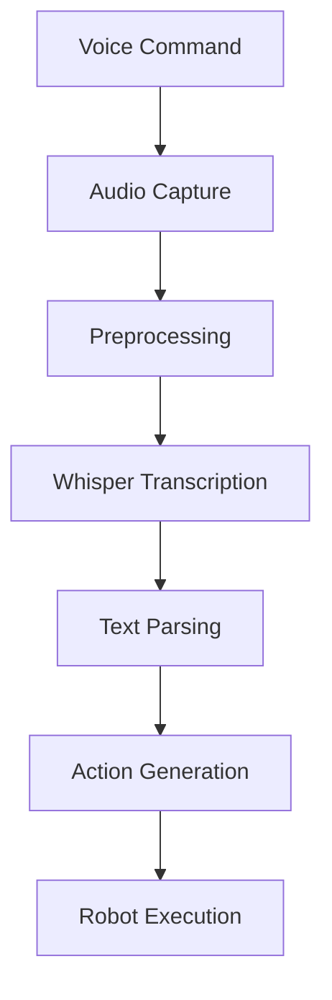

import Layout from '@theme/Layout';
import { useState } from 'react';

# Voice-to-Action Pipeline with Whisper

This module covers Vision-Language-Action (VLA) robotics, focusing on how voice commands are processed through Whisper-based speech recognition, converted to text, and transformed into actionable commands for humanoid robots.

## Overview

The Voice-to-Action pipeline is the foundational component of VLA systems, enabling human-robot interaction through natural language. This module explores:

- Whisper-based speech recognition
- Text processing and understanding
- Transformation to robot action sequences
- Integration with ROS 2 action servers

## Learning Objectives

By the end of this chapter, you will be able to:

1. Set up Whisper for speech recognition in robotics applications
2. Process voice commands and convert them to text
3. Transform text commands into executable robot actions
4. Understand the complete pipeline from voice input to robot execution
5. Implement basic voice-controlled robot behaviors

## Table of Contents

1. [Whisper Speech Recognition](#whisper-speech-recognition)
2. [Voice Command Processing](#voice-command-processing)
3. [Text-to-Action Transformation](#text-to-action-transformation)
4. [ROS 2 Integration](#ros-2-integration)
5. [Pipeline Implementation](#pipeline-implementation)
6. [Best Practices](#best-practices)

## Whisper Speech Recognition

Whisper is OpenAI's automatic speech recognition (ASR) system that converts spoken language into text. For robotics applications, Whisper provides:

- High accuracy across multiple languages
- Robustness to background noise
- Real-time processing capabilities
- Integration with Python ecosystems

### Whisper Models

Different Whisper models offer trade-offs between speed and accuracy:

- **Tiny**: Fastest but lowest accuracy
- **Base**: Good balance of speed and accuracy
- **Small**: Higher accuracy, slower processing
- **Medium**: Better accuracy, moderate processing time
- **Large**: Highest accuracy, slowest processing

For robotics applications, the choice depends on your computational resources and accuracy requirements.

## Voice Command Processing

Processing voice commands involves several steps:

1. **Audio capture**: Recording the user's voice command
2. **Preprocessing**: Cleaning and normalizing the audio
3. **Transcription**: Converting speech to text using Whisper
4. **Parsing**: Interpreting the meaning of the transcribed text
5. **Action generation**: Creating executable robot commands



## Text-to-Action Transformation

Converting natural language commands to robot actions requires understanding the intent and extracting relevant parameters:

- **Navigation commands**: "Go to the kitchen", "Move to the table"
- **Manipulation commands**: "Pick up the red cup", "Place the book on the shelf"
- **Query commands**: "Show me the blue ball", "Where is the remote?"

The transformation process typically involves:
1. Command classification
2. Parameter extraction
3. Action sequence generation
4. Validation and error handling

## ROS 2 Integration

Integrating the voice pipeline with ROS 2 involves:

- **Action servers**: Long-running tasks with feedback
- **Services**: Request-response interactions
- **Topics**: Continuous data streams
- **Parameters**: Configuration settings

The voice pipeline typically communicates with action servers for complex behaviors and services for immediate responses.

## Pipeline Implementation

Here's a basic implementation of the voice-to-action pipeline:

```python
import whisper
import rclpy
from rclpy.node import Node
from std_msgs.msg import String
from action_msgs.msg import GoalStatus

class VoiceToActionNode(Node):
    def __init__(self):
        super().__init__('voice_to_action_node')

        # Initialize Whisper model
        self.model = whisper.load_model("base")

        # Publishers and subscribers
        self.command_publisher = self.create_publisher(String, 'robot_commands', 10)

        # Timer for periodic processing
        self.timer = self.create_timer(1.0, self.process_voice_input)

        self.get_logger().info("Voice-to-Action node initialized")

    def process_voice_input(self):
        """Process voice input and convert to robot commands"""
        # In a real implementation, this would capture audio
        # For demo, we'll simulate voice input
        simulated_transcript = self.simulate_voice_input()

        if simulated_transcript:
            self.get_logger().info(f"Processed: {simulated_transcript}")

            # Convert to robot command
            robot_cmd = self.text_to_action(simulated_transcript)
            if robot_cmd:
                cmd_msg = String()
                cmd_msg.data = robot_cmd
                self.command_publisher.publish(cmd_msg)

    def simulate_voice_input(self):
        """Simulate voice input for demonstration"""
        # In a real implementation, this would capture from microphone
        return "move forward 2 meters"

    def text_to_action(self, text):
        """Convert text command to robot action"""
        text_lower = text.lower()

        if "move" in text_lower:
            if "forward" in text_lower:
                return "MOVE_FORWARD_2M"
            elif "backward" in text_lower:
                return "MOVE_BACKWARD_1M"
        elif "turn" in text_lower or "rotate" in text_lower:
            if "left" in text_lower:
                return "TURN_LEFT_90"
            elif "right" in text_lower:
                return "TURN_RIGHT_90"
        elif "pick" in text_lower or "grasp" in text_lower:
            return "PICK_OBJECT"
        elif "place" in text_lower or "drop" in text_lower:
            return "PLACE_OBJECT"

        return None  # Unknown command

def main(args=None):
    rclpy.init(args=args)
    node = VoiceToActionNode()

    try:
        rclpy.spin(node)
    except KeyboardInterrupt:
        pass
    finally:
        node.destroy_node()
        rclpy.shutdown()

if __name__ == '__main__':
    main()
```

## VLA Pipeline Diagram

<figure>
  
  <figcaption>Architecture of the Vision-Language-Action (VLA) pipeline showing the flow from voice commands through Whisper ASR, LLM cognitive planning, ROS 2 action graph generation, to robot execution</figcaption>
</figure>

## Runnable Voice-to-Action Examples

### Example 1: Basic Voice Command Processing

```python
#!/usr/bin/env python3
"""
Basic Voice Command Processing Example
"""

import whisper
import rclpy
from rclpy.node import Node
from std_msgs.msg import String
import numpy as np
import sounddevice as sd
from scipy.io.wavfile import write
import tempfile
import os

class BasicVoiceProcessor(Node):
    def __init__(self):
        super().__init__('basic_voice_processor')

        # Initialize Whisper model
        self.model = whisper.load_model("base")

        # Publisher for processed commands
        self.command_publisher = self.create_publisher(String, 'processed_commands', 10)

        # Record and process audio
        self.get_logger().info("Basic Voice Processor initialized")

    def record_and_process(self, duration=5.0, sample_rate=16000):
        """Record audio and process it with Whisper"""
        self.get_logger().info(f"Recording audio for {duration} seconds...")

        # Record audio
        audio_data = sd.rec(
            int(duration * sample_rate),
            samplerate=sample_rate,
            channels=1,
            dtype='float32'
        )
        sd.wait()  # Wait until recording is finished

        # Convert to mono if needed
        if len(audio_data.shape) > 1:
            audio_data = audio_data.mean(axis=1)

        # Save to temporary file for Whisper processing
        temp_file = tempfile.NamedTemporaryFile(delete=False, suffix='.wav')
        write(temp_file.name, sample_rate, (audio_data * 32767).astype(np.int16))

        # Transcribe using Whisper
        result = self.model.transcribe(temp_file.name)
        transcription = result["text"].strip()

        # Clean up temporary file
        os.unlink(temp_file.name)

        self.get_logger().info(f"Transcription: '{transcription}'")

        # Publish the processed command
        cmd_msg = String()
        cmd_msg.data = transcription
        self.command_publisher.publish(cmd_msg)

        return transcription

def main(args=None):
    rclpy.init(args=args)
    processor = BasicVoiceProcessor()

    # Process a sample command
    transcription = processor.record_and_process(duration=3.0)
    print(f"Recorded command: {transcription}")

    processor.destroy_node()
    rclpy.shutdown()

if __name__ == '__main__':
    main()
```

### Example 2: Voice Command Interpreter

```python
import re
from typing import Dict, Any

class VoiceCommandInterpreter:
    """
    Interprets voice commands and converts them to robot actions
    """

    def __init__(self):
        # Define command patterns and their corresponding robot actions
        self.command_patterns = {
            # Navigation commands
            r"go to the (.+)": "NAVIGATE_TO_LOCATION",
            r"move to the (.+)": "NAVIGATE_TO_LOCATION",
            r"go to (.+)": "NAVIGATE_TO_LOCATION",
            r"move to (.+)": "NAVIGATE_TO_LOCATION",
            r"move forward": "MOVE_FORWARD",
            r"move backward": "MOVE_BACKWARD",
            r"go forward": "MOVE_FORWARD",
            r"go backward": "MOVE_BACKWARD",
            r"turn left": "TURN_LEFT",
            r"turn right": "TURN_RIGHT",
            r"rotate left": "ROTATE_LEFT",
            r"rotate right": "ROTATE_RIGHT",

            # Manipulation commands
            r"pick up the (.+)": "PICK_UP_OBJECT",
            r"grab the (.+)": "PICK_UP_OBJECT",
            r"take the (.+)": "PICK_UP_OBJECT",
            r"grasp the (.+)": "PICK_UP_OBJECT",
            r"place the (.+)": "PLACE_OBJECT",
            r"put down the (.+)": "PUT_DOWN_OBJECT",
            r"release the (.+)": "RELEASE_OBJECT",

            # Object interaction
            r"detect (.+)": "DETECT_OBJECT",
            r"find (.+)": "FIND_OBJECT",
            r"show me the (.+)": "SHOW_OBJECT",

            # Movement commands
            r"stop": "STOP",
            r"halt": "STOP",
            r"pause": "PAUSE",
            r"continue": "CONTINUE"
        }

        # Map action types to parameter extraction patterns
        self.parameter_patterns = {
            "NAVIGATE_TO_LOCATION": r"(?:go to the |move to the |go to |move to )(.+)",
            "PICK_UP_OBJECT": r"(?:pick up the |grab the |take the |grasp the )(.+)",
            "PLACE_OBJECT": r"(?:place the |put the )(.+)",
            "DETECT_OBJECT": r"(?:detect |find |show me the )(.+)"
        }

    def interpret_command(self, transcription: str) -> Dict[str, Any]:
        """
        Interpret a transcribed command and convert to robot action

        Args:
            transcription: The transcribed text from speech

        Returns:
            Dictionary containing action type and parameters
        """
        transcription_lower = transcription.lower().strip()

        # Try to match each pattern
        for pattern, action_type in self.command_patterns.items():
            match = re.search(pattern, transcription_lower)
            if match:
                # Extract parameters if needed
                params = {}

                # Extract the matched object/location
                if action_type in self.parameter_patterns:
                    param_match = re.search(self.parameter_patterns[action_type], transcription_lower)
                    if param_match:
                        params['target'] = param_match.group(1).strip()

                return {
                    "action_type": action_type,
                    "raw_command": transcription,
                    "parameters": params,
                    "confidence": 0.8  # High confidence for pattern-matched commands
                }

        # If no pattern matches, return unknown command
        return {
            "action_type": "UNKNOWN_COMMAND",
            "raw_command": transcription,
            "parameters": {},
            "confidence": 0.0
        }

# Example usage
def example_usage():
    interpreter = VoiceCommandInterpreter()

    # Test various commands
    test_commands = [
        "Go to the kitchen",
        "Pick up the red cup",
        "Turn left and move forward",
        "Detect the blue ball",
        "Place the object on the table"
    ]

    print("Testing voice command interpretation:")
    for cmd in test_commands:
        result = interpreter.interpret_command(cmd)
        print(f"Command: '{cmd}' -> Action: {result['action_type']}, Params: {result['parameters']}")

if __name__ == "__main__":
    example_usage()
```

### Example 3: Audio Configuration

The audio configuration file sets up the parameters for voice processing:

```yaml
# Audio Configuration for VLA Voice-to-Action Pipeline

# Audio input settings
audio_input:
  sample_rate: 16000
  channels: 1
  bit_depth: 16
  buffer_size: 1024

# Whisper ASR settings
whisper:
  model_size: "base"  # Options: tiny, base, small, medium, large
  device: "auto"      # Options: cpu, cuda, auto
  language: "en"      # Language code for recognition
  temperature: 0.0    # Temperature for sampling (0.0 for deterministic)

# Recording settings
recording:
  default_duration: 5.0    # Default recording duration in seconds
  max_duration: 10.0       # Maximum allowed recording duration
  silence_threshold: 0.01  # Threshold for detecting silence (normalized)
  silence_duration: 1.0    # Duration of silence to stop recording

# Processing settings
processing:
  confidence_threshold: 0.3  # Minimum confidence for accepting transcription
  vad_enabled: true          # Voice Activity Detection enabled
  noise_suppression: true    # Enable noise suppression
  gain_control: true         # Enable automatic gain control

# Output settings
output:
  publish_transcriptions: true    # Whether to publish transcriptions to ROS topic
  publish_confidence: true        # Whether to publish confidence scores
  save_recordings: false          # Whether to save recordings to file
  recording_directory: "./recordings"  # Directory for saving recordings

# Topic names
topics:
  audio_input: "/audio_input"
  voice_commands: "/voice_commands"
  command_confidence: "/command_confidence"
  robot_commands: "/cmd_vel"

# Node settings
node:
  name: "voice_command_processor"
  qos_depth: 10
```

## Best Practices

1. **Error handling**: Always handle transcription failures gracefully
2. **Confidence thresholds**: Verify Whisper confidence scores before processing
3. **Timeout management**: Set reasonable timeouts for voice input
4. **Feedback mechanisms**: Provide audio/visual feedback for processed commands
5. **Privacy considerations**: Handle sensitive voice data appropriately

## Summary

The Voice-to-Action pipeline forms the foundation of human-robot interaction in VLA systems. By combining Whisper's speech recognition capabilities with ROS 2's action architecture, robots can respond to natural language commands effectively.