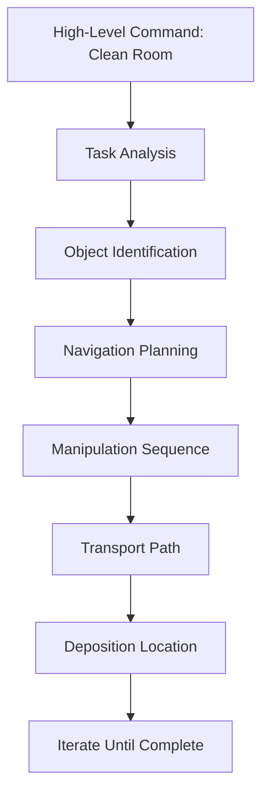

import Layout from '@theme/Layout';
import { useState } from 'react';

# LLM-Based Cognitive Planning

This module explores how large language models (LLMs) enable cognitive planning in robotics, allowing complex natural language tasks to be decomposed into executable sequences for humanoid robots.

## Overview

Large Language Models (LLMs) serve as the cognitive layer in VLA systems, bridging the gap between high-level human instructions and low-level robot actions. This module covers:

- Task decomposition with LLMs
- Cognitive planning algorithms
- High-level command interpretation
- Integration with robot action sequences

## Learning Objectives

By the end of this chapter, you will be able to:

1. Implement LLM-based task decomposition for robotics
2. Create cognitive planning systems using LLMs
3. Translate complex commands like "Clean the room" into action sequences
4. Handle ambiguous or complex natural language instructions
5. Integrate LLM outputs with ROS 2 action systems

## Table of Contents

1. [Introduction to LLM-Based Planning](#introduction-to-llm-based-planning)
2. [Task Decomposition](#task-decomposition)
3. [Cognitive Planning Algorithms](#cognitive-planning-algorithms)
4. [LLM Integration](#llm-integration)
5. [Handling Complex Commands](#handling-complex-commands)
6. [Implementation Examples](#implementation-examples)
7. [Best Practices](#best-practices)

## Introduction to LLM-Based Planning

Large Language Models have revolutionized robotics by enabling sophisticated understanding of natural language commands. Unlike traditional rule-based systems, LLMs can:

- Interpret ambiguous or complex instructions
- Understand context and environmental constraints
- Generate detailed action sequences from high-level goals
- Adapt to novel situations and environments
- Handle multi-step reasoning tasks

### Advantages of LLM-Based Planning

- **Natural interaction**: Users can speak naturally without learning robot-specific commands
- **Flexibility**: Same system works across different robot platforms
- **Adaptability**: Can handle novel situations not explicitly programmed
- **Rich reasoning**: Can infer implicit requirements and constraints

## Task Decomposition

Task decomposition is the process of breaking down high-level goals into executable action sequences. For example, "Clean the room" might decompose to:

1. **Identify objects**: Locate items that need to be cleaned up
2. **Navigate**: Move to the location of the first object
3. **Perceive**: Identify the object and its properties
4. **Manipulate**: Pick up the object
5. **Transport**: Carry the object to disposal location
6. **Deposit**: Place the object in appropriate location
7. **Repeat**: Continue until room is clean

### Decomposition Strategies

LLMs can employ various strategies for effective task decomposition:

- **Hierarchical decomposition**: Break complex tasks into subtasks recursively
- **Sequential planning**: Plan actions in chronological order
- **Parallelizable actions**: Identify actions that can be performed simultaneously
- **Conditional execution**: Plan for different scenarios based on environment



## Cognitive Planning Algorithms

Cognitive planning combines LLM reasoning with traditional planning algorithms:

### Symbolic Planning

- Uses symbolic representations of the world
- Combines LLM-generated plans with classical planners
- Enables formal verification of plans

### Hierarchical Task Networks (HTNs)

- Decomposes tasks into hierarchies
- Uses LLMs to guide decomposition decisions
- Maintains plan consistency across levels

### Partial Order Planning

- Allows flexible ordering of actions
- LLMs can suggest preferred orderings
- Adapts to environmental constraints

## LLM Integration

Integrating LLMs into robotics systems requires careful consideration of:

### Prompt Engineering

Effective prompts guide LLMs to produce structured, actionable outputs:

```python
def create_task_decomposition_prompt(task_description, robot_capabilities, environment_state):
    """
    Create a prompt for task decomposition

    Args:
        task_description: Natural language task description
        robot_capabilities: List of robot capabilities
        environment_state: Current state of the environment
    """
    prompt = f"""
    Decompose the following high-level task into specific, executable robot actions:

    TASK: {task_description}

    ROBOT CAPABILITIES: {', '.join(robot_capabilities)}

    ENVIRONMENT STATE: {environment_state}

    Provide the decomposition as a numbered sequence of actions. Each action should be:
    1. Specific and actionable
    2. Compatible with the robot's capabilities
    3. Account for the environment state
    4. Include any necessary parameters

    Format:
    1. [ACTION_NAME] - [DESCRIPTION] (parameters: [PARAMETERS])
    2. [ACTION_NAME] - [DESCRIPTION] (parameters: [PARAMETERS])
    ...

    Example:
    1. NAVIGATE_TO_LOCATION - Move robot to kitchen (parameters: location: kitchen)
    2. DETECT_OBJECTS - Identify objects in workspace (parameters: none)
    3. GRASP_OBJECT - Pick up identified object (parameters: object_id: red_cup)
    4. TRANSPORT_OBJECT - Move object to destination (parameters: destination: shelf)
    5. RELEASE_OBJECT - Place object at destination (parameters: none)
    """
    return prompt
```

### Response Parsing

LLM responses need to be parsed into structured robot commands:

```python
import re

def parse_llm_response(response):
    """
    Parse LLM response into structured action sequence
    """
    # Extract numbered actions
    action_pattern = r'^(\d+)\.\s*\[([A-Z_]+)\]\s*-\s*(.*?)\s*\((.*?)\)$'

    actions = []
    for line in response.split('\n'):
        match = re.match(action_pattern, line.strip())
        if match:
            action = {
                'step': int(match.group(1)),
                'name': match.group(2),
                'description': match.group(3),
                'parameters': parse_parameters(match.group(4))
            }
            actions.append(action)

    return sorted(actions, key=lambda x: x['step'])

def parse_parameters(param_str):
    """
    Parse parameter string into dictionary
    """
    params = {}
    if param_str.lower() != 'none':
        pairs = param_str.split(',')
        for pair in pairs:
            if ':' in pair:
                key, value = pair.split(':', 1)
                params[key.strip()] = value.strip()
    return params
```

## Handling Complex Commands

LLMs excel at interpreting complex, multi-faceted commands:

### Ambiguity Resolution

When commands are ambiguous, LLMs can suggest clarifications:

```python
def resolve_ambiguity(command, environment_context):
    """
    Identify and resolve ambiguities in commands
    """
    ambiguity_prompt = f"""
    Identify ambiguities in the following command and suggest resolutions:

    COMMAND: {command}
    ENVIRONMENT: {environment_context}

    Output format:
    - Ambiguity: [description of ambiguity]
      Resolution: [suggested resolution]
    - Ambiguity: [description of ambiguity]
      Resolution: [suggested resolution]
    """

    # Call LLM with this prompt
    # Return structured ambiguity resolution
```

### Multi-Step Reasoning

LLMs can perform complex reasoning for multi-step tasks:

```python
def plan_complex_task(initial_state, goal_state, available_actions):
    """
    Plan a complex task requiring multi-step reasoning
    """
    reasoning_prompt = f"""
    Given the initial state: {initial_state}
    And the goal state: {goal_state}
    And available actions: {available_actions}

    Plan a sequence of actions to reach the goal state.
    Consider:
    1. Precondition requirements for each action
    2. Effects of each action on the world state
    3. Potential obstacles and how to overcome them
    4. Resource constraints (battery, time, etc.)

    Provide a step-by-step plan with justification for each step.
    """

    # Call LLM with this prompt
    # Return structured plan
```

## Implementation Examples

Here's a complete example of LLM-based cognitive planning:

```python
import openai
from typing import List, Dict, Any

class LLMBasedPlanner:
    def __init__(self, api_key: str, model: str = "gpt-3.5-turbo"):
        """
        Initialize the LLM-based planner

        Args:
            api_key: OpenAI API key
            model: LLM model to use
        """
        openai.api_key = api_key
        self.model = model
        self.capabilities = [
            "NAVIGATE_TO_LOCATION",
            "DETECT_OBJECTS",
            "GRASP_OBJECT",
            "RELEASE_OBJECT",
            "TRANSPORT_OBJECT",
            "QUERY_ENVIRONMENT",
            "WAIT_FOR_CONDITION"
        ]

    def decompose_task(self, task_description: str, environment_state: str) -> List[Dict[str, Any]]:
        """
        Decompose a high-level task into executable actions

        Args:
            task_description: Natural language task description
            environment_state: Current state of the environment

        Returns:
            List of structured actions
        """
        prompt = f"""
        Decompose the following task into specific, executable robot actions:

        TASK: {task_description}
        ENVIRONMENT: {environment_state}
        ROBOT_CAPABILITIES: {', '.join(self.capabilities)}

        Provide the result as a numbered sequence of actions in the following format:
        1. [ACTION_TYPE] - [DESCRIPTION] (params: [KEY]=VALUE)
        2. [ACTION_TYPE] - [DESCRIPTION] (params: [KEY]=VALUE)

        Each action must be:
        - From the robot capabilities list
        - Specific and executable
        - Include all necessary parameters
        - Logically connected to achieve the task goal

        Example:
        1. QUERY_ENVIRONMENT - Find objects to clean (params: category=debris)
        2. NAVIGATE_TO_LOCATION - Move to object location (params: x=1.2, y=0.8)
        3. DETECT_OBJECTS - Identify specific object (params: target=red_cup)
        4. GRASP_OBJECT - Pick up object (params: object_id=red_cup)
        5. NAVIGATE_TO_LOCATION - Move to disposal area (params: x=0.0, y=0.0)
        6. RELEASE_OBJECT - Place object in disposal (params: none)
        """

        response = openai.ChatCompletion.create(
            model=self.model,
            messages=[
                {"role": "system", "content": "You are an expert in robotics task planning. Decompose high-level tasks into specific, executable robot actions."},
                {"role": "user", "content": prompt}
            ]
        )

        return self.parse_response(response.choices[0].message.content)

    def parse_response(self, response: str) -> List[Dict[str, Any]]:
        """
        Parse the LLM response into structured actions
        """
        actions = []
        for line in response.split('\n'):
            if line.strip() and line[0].isdigit():
                # Parse action format: "1. [ACTION_TYPE] - [DESCRIPTION] (params: ...)"
                parts = line.split(' - ', 1)
                if len(parts) == 2:
                    action_part = parts[0].split('. ', 1)[1]  # Remove number
                    desc_and_params = parts[1]

                    # Extract parameters
                    params = {}
                    if '(params:' in desc_and_params:
                        desc_part, params_part = desc_and_params.split('(params:', 1)
                        desc = desc_part.strip()
                        params_str = params_part.rstrip(')').strip()

                        if params_str.lower() != 'none':
                            for param in params_str.split(','):
                                if '=' in param:
                                    k, v = param.split('=', 1)
                                    params[k.strip()] = v.strip()
                    else:
                        desc = desc_and_params.rstrip(')').strip()

                    action = {
                        'action_type': action_part.strip('[]'),
                        'description': desc,
                        'parameters': params
                    }
                    actions.append(action)

        return actions

# Example usage
def example_usage():
    planner = LLMBasedPlanner(api_key="your-openai-api-key")

    task = "Clean the living room by picking up all books and placing them on the bookshelf"
    env_state = "Living room with scattered books on floor, couch, and coffee table. Bookshelf located near window."

    plan = planner.decompose_task(task, env_state)

    print("Generated Plan:")
    for i, action in enumerate(plan, 1):
        print(f"{i}. {action['action_type']}: {action['description']}")
        if action['parameters']:
            print(f"   Parameters: {action['parameters']}")

if __name__ == "__main__":
    example_usage()
```

## Task Decomposition Flow Diagram

<figure>
  
  <figcaption>Flow diagram showing how high-level tasks are processed through LLM cognitive planning to produce executable action sequences for humanoid robots</figcaption>
</figure>

## Advanced Task Decomposition Examples

### Example 1: Multi-Step Reasoning

```python
class AdvancedTaskDecomposer:
    def __init__(self, llm_client):
        self.llm_client = llm_client

    def plan_complex_task(self, initial_state, goal_state, available_actions):
        """
        Plan a complex task requiring multi-step reasoning
        """
        reasoning_prompt = f"""
        Given the initial state: {initial_state}
        And the goal state: {goal_state}
        And available actions: {available_actions}

        Plan a sequence of actions to reach the goal state.
        Consider:
        1. Precondition requirements for each action
        2. Effects of each action on the world state
        3. Potential obstacles and how to overcome them
        4. Resource constraints (battery, time, etc.)

        Provide a step-by-step plan with justification for each step.
        """

        response = self.llm_client.generate(reasoning_prompt)
        return self.parse_complex_plan(response)

    def resolve_ambiguity(self, command, environment_context):
        """
        Identify and resolve ambiguities in commands
        """
        ambiguity_prompt = f"""
        Identify ambiguities in the following command and suggest resolutions:

        COMMAND: {command}
        ENVIRONMENT: {environment_context}

        Output format:
        - Ambiguity: [description of ambiguity]
          Resolution: [suggested resolution]
        - Ambiguity: [description of ambiguity]
          Resolution: [suggested resolution]
        """

        response = self.llm_client.generate(ambiguity_prompt)
        return self.parse_ambiguity_resolution(response)
```

### Example 2: Hierarchical Task Networks

```python
class HTNPlanner:
    """
    Hierarchical Task Network planner using LLMs for decomposition
    """
    def __init__(self, llm_interface):
        self.llm = llm_interface

    def decompose_high_level_task(self, task, environment_state):
        """
        Decompose high-level tasks into subtasks using hierarchical planning
        """
        htn_prompt = f"""
        Decompose the following high-level task into a hierarchy of subtasks:

        TASK: {task}
        ENVIRONMENT: {environment_state}

        Provide the decomposition as a hierarchical JSON structure:
        {{
            "task": "original task",
            "subtasks": [
                {{
                    "task": "subtask name",
                    "description": "what to do",
                    "type": "primitive|composite",
                    "dependencies": ["other_subtask_ids"],
                    "parameters": {{"needed": "values"}},
                    "subtasks": [
                        // Recursive structure for deeper decomposition
                    ]
                }}
            ],
            "execution_order": ["sequence of subtask execution"],
            "success_criteria": ["conditions that indicate task completion"]
        }}

        The decomposition should:
        - Break complex tasks into simpler, manageable subtasks
        - Respect task dependencies and constraints
        - Include both primitive actions and composite tasks
        - Provide clear success criteria for each level
        """

        response = self.llm.generate(htn_prompt)
        return self.parse_htn_decomposition(response)
```

### Example 3: Prompt Templates for Task Decomposition

The following prompt templates can be used for consistent task decomposition:

```txt
# Basic Task Decomposition Prompt Template

Decompose the following high-level task into specific, executable robot actions:

TASK: {{task_description}}

ENVIRONMENT STATE:
{{environment_state}}

ROBOT CAPABILITIES:
{{robot_capabilities}}

AVAILABLE ACTION TYPES:
{{available_action_types}}

Provide the result as a JSON array of action steps. Each action step should have:
- action_type: The type of action (must be one of the available action types)
- parameters: Dictionary of parameters needed for the action
- description: Human-readable description of the action
- priority: Priority level (1-5, where 1 is highest priority)
- estimated_duration: Estimated time to complete the action in seconds

Example format:
[
    {{
        "action_type": "NAVIGATE_TO_LOCATION",
        "parameters": {{"x": 1.0, "y": 2.0, "theta": 0.0}},
        "description": "Navigate to the kitchen counter",
        "priority": 1,
        "estimated_duration": 5.0
    }},
    {{
        "action_type": "DETECT_OBJECT",
        "parameters": {{"target_object": "red cup"}},
        "description": "Detect the red cup on the counter",
        "priority": 2,
        "estimated_duration": 2.0
    }}
]

Ensure that:
1. Actions are logically ordered (consider dependencies)
2. Parameters are specific and actionable
3. Actions are compatible with the robot's capabilities
4. The sequence achieves the overall task goal
5. Include error handling steps if appropriate
```

## Best Practices

1. **Prompt engineering**: Invest time in crafting effective prompts for consistent results
2. **Response validation**: Always validate LLM outputs before execution
3. **Error handling**: Plan for cases where LLM produces invalid outputs
4. **Context management**: Maintain context for multi-turn interactions
5. **Safety considerations**: Validate all actions before execution
6. **Fallback strategies**: Have rule-based alternatives for critical functions
7. **Monitoring**: Track LLM performance and adjust prompts as needed

## Summary

LLM-based cognitive planning enables sophisticated robot behaviors by translating high-level human instructions into executable action sequences. By combining the reasoning capabilities of LLMs with the precision of robotic action execution, robots can handle complex, natural language commands effectively.