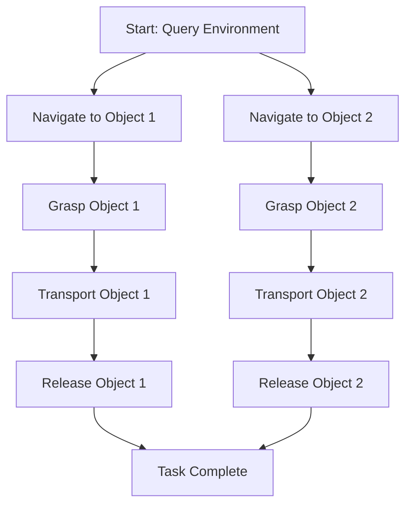

import Layout from '@theme/Layout';
import { useState } from 'react';

# ROS 2 Action Graphs for Humanoid Tasks

This module explores how natural language tasks are converted into ROS 2 action sequences and action graphs that coordinate humanoid robot behaviors, with understanding of the structure and execution of complex multi-step tasks.

## Overview

ROS 2 Action Graphs provide a structured approach to coordinate complex humanoid robot behaviors by converting natural language commands into executable action sequences. This module covers:

- Action graph generation from LLM outputs
- ROS 2 action sequence coordination
- Multi-step task execution
- Dependency management in action graphs
- Humanoid-specific action servers

## Learning Objectives

By the end of this chapter, you will be able to:

1. Generate action graphs from LLM cognitive planning outputs
2. Implement ROS 2 action servers for humanoid robots
3. Coordinate complex multi-step tasks using action graphs
4. Manage dependencies between robot actions
5. Visualize and debug action graph execution

## Table of Contents

1. [Introduction to Action Graphs](#introduction-to-action-graphs)
2. [Action Graph Generation](#action-graph-generation)
3. [ROS 2 Action Coordination](#ros-2-action-coordination)
4. [Humanoid Action Servers](#humanoid-action-servers)
5. [Dependency Management](#dependency-management)
6. [Implementation Examples](#implementation-examples)
7. [Visualization and Debugging](#visualization-and-debugging)
8. [Best Practices](#best-practices)

## Introduction to Action Graphs

Action graphs represent the execution flow of complex robotic tasks as a directed graph where nodes are individual actions and edges represent dependencies between actions. This approach allows for:

- Parallel execution of independent actions
- Proper sequencing of dependent actions
- Error handling and recovery strategies
- Visualization of task structure
- Dynamic re-planning when conditions change

### Components of an Action Graph

An action graph consists of:

- **Action Nodes**: Individual robot actions (navigation, manipulation, perception, etc.)
- **Dependencies**: Relationships between actions that determine execution order
- **Parameters**: Configuration data for each action
- **Start Nodes**: Actions that can be executed immediately
- **End Nodes**: Actions that complete the overall task

### Benefits of Action Graphs

- **Flexibility**: Can represent complex, non-linear task structures
- **Efficiency**: Enables parallel execution where possible
- **Robustness**: Provides clear error handling paths
- **Debugging**: Visual representation makes issues easier to identify
- **Reusability**: Action graphs can be modified and reused for similar tasks

## Action Graph Generation

Action graphs are typically generated from high-level task descriptions processed by LLM cognitive planning systems. The generation process involves:

1. **Task Decomposition**: Breaking down high-level commands into atomic actions
2. **Dependency Analysis**: Determining which actions must precede others
3. **Parameter Assignment**: Assigning specific parameters to each action
4. **Validation**: Ensuring the graph is acyclic and executable

### Example Generation Process

Here's how a natural language command like "Clean the room" gets converted to an action graph:

1. **LLM Decomposition**: "Clean the room" → [Identify objects, Navigate to object, Grasp object, Transport object, Release object]
2. **Dependency Assignment**: Each grasp action depends on navigation completion
3. **Parameter Generation**: Specific coordinates, object IDs, etc.
4. **Graph Formation**: Directed graph with proper execution order

### Action Graph Structure



## ROS 2 Action Coordination

ROS 2 provides a robust framework for coordinating complex robotic tasks through action servers and clients. Action graphs leverage this framework to execute multi-step tasks:

### Action Server Implementation

Action servers execute individual actions and provide feedback on progress:

```python
import rclpy
from rclpy.action import ActionServer
from rclpy.node import Node

class HumanoidActionServer(Node):
    def __init__(self):
        super().__init__('humanoid_action_server')
        # Initialize action server
        self._action_server = ActionServer(
            self,
            YourActionType,
            'execute_action',
            self.execute_callback)

    def execute_callback(self, goal_handle):
        # Execute the action based on goal
        # Provide feedback during execution
        # Return result when complete
        pass
```

### Action Client Coordination

Action clients coordinate the execution of action graphs by managing dependencies:

```python
from rclpy.action import ActionClient

class ActionGraphExecutor(Node):
    def __init__(self):
        super().__init__('action_graph_executor')
        self.action_clients = {}
        # Create action clients for different action types

    def execute_action_graph(self, graph):
        # Execute actions respecting dependencies
        # Handle failures and recovery
        # Provide overall progress feedback
        pass
```

## Humanoid Action Servers

Humanoid robots require specialized action servers that handle their unique capabilities and constraints:

### Navigation Actions

Humanoid navigation differs from wheeled robots due to legged locomotion:

```python
class HumanoidNavigationActionServer(Node):
    def __init__(self):
        super().__init__('humanoid_navigation_server')
        self._action_server = ActionServer(
            self,
            NavigateToPose,
            'navigate_to_pose',
            self.execute_callback)

    def execute_callback(self, goal_handle):
        # Handle humanoid-specific navigation
        # Consider balance, step planning, etc.
        pass
```

### Manipulation Actions

Humanoid manipulation leverages anthropomorphic capabilities:

```python
class HumanoidManipulationActionServer(Node):
    def __init__(self):
        super().__init__('humanoid_manipulation_server')
        self._action_server = ActionServer(
            self,
            ManipulateObject,
            'manipulate_object',
            self.execute_callback)

    def execute_callback(self, goal_handle):
        # Execute manipulation with humanoid kinematics
        # Consider reach, dexterity, etc.
        pass
```

### Whole-Body Actions

Complex humanoid tasks often require coordinated whole-body motion:

```python
class WholeBodyActionServer(Node):
    def __init__(self):
        super().__init__('whole_body_server')
        self._action_server = ActionServer(
            self,
            WholeBodyAction,
            'whole_body_action',
            self.execute_callback)

    def execute_callback(self, goal_handle):
        # Coordinate multiple joints and subsystems
        # Ensure balance and stability
        pass
```

## Dependency Management

Proper dependency management ensures actions execute in the correct order while maximizing parallel execution:

### Dependency Types

- **Sequential Dependencies**: Action B must wait for Action A to complete
- **Resource Dependencies**: Actions that require exclusive access to resources
- **State Dependencies**: Actions that depend on specific environmental states
- **Temporal Dependencies**: Actions that must occur within specific time windows

### Topological Sorting

Action graphs use topological sorting to determine execution order:

```python
def topological_sort(graph):
    """
    Perform topological sort to determine execution order respecting dependencies.
    """
    # Build adjacency list and in-degree count
    adj_list = {node.id: [] for node in graph.nodes}
    in_degree = {node.id: 0 for node in graph.nodes}

    for node in graph.nodes:
        for dep in node.dependencies:
            if dep in adj_list:
                adj_list[dep].append(node.id)
                in_degree[node.id] += 1

    # Kahn's algorithm for topological sorting
    queue = []
    for node_id, degree in in_degree.items():
        if degree == 0:
            queue.append(node_id)

    result = []
    while queue:
        current = queue.pop(0)
        result.append(current)

        for neighbor in adj_list[current]:
            in_degree[neighbor] -= 1
            if in_degree[neighbor] == 0:
                queue.append(neighbor)

    # Check if all nodes were processed (no cycles)
    if len(result) != len(graph.nodes):
        raise ValueError("Cycle detected in action graph dependencies")

    return result
```

### Parallel Execution

Independent actions can be executed in parallel to improve efficiency:

```python
import asyncio
from concurrent.futures import ThreadPoolExecutor

class ParallelActionExecutor:
    def __init__(self, max_workers=4):
        self.executor = ThreadPoolExecutor(max_workers=max_workers)

    async def execute_parallel_actions(self, action_list):
        """
        Execute multiple actions in parallel where dependencies allow.
        """
        loop = asyncio.get_event_loop()

        # Submit actions to executor
        futures = []
        for action in action_list:
            future = loop.run_in_executor(
                self.executor,
                self.execute_action,
                action
            )
            futures.append(future)

        # Wait for all actions to complete
        results = await asyncio.gather(*futures)
        return results
```

## Implementation Examples

Here's a complete example of action graph generation and execution:

```python
#!/usr/bin/env python3
"""
Complete example of action graph generation and execution for humanoid robots.
"""

import json
import yaml
from typing import Dict, List, Any
from enum import Enum
from dataclasses import dataclass

# Define action types
class ActionType(Enum):
    NAVIGATE_TO_LOCATION = "NAVIGATE_TO_LOCATION"
    DETECT_OBJECT = "DETECT_OBJECT"
    GRASP_OBJECT = "GRASP_OBJECT"
    RELEASE_OBJECT = "RELEASE_OBJECT"
    TRANSPORT_OBJECT = "TRANSPORT_OBJECT"
    QUERY_ENVIRONMENT = "QUERY_ENVIRONMENT"
    WAIT_FOR_CONDITION = "WAIT_FOR_CONDITION"
    SPEAK = "SPEAK"
    LISTEN = "LISTEN"

@dataclass
class ActionNode:
    id: str
    action_type: ActionType
    description: str
    parameters: Dict[str, Any]
    dependencies: List[str]
    priority: int = 1
    estimated_duration: float = 0.0

@dataclass
class ActionGraph:
    name: str
    description: str
    nodes: List[ActionNode]
    start_nodes: List[str]
    end_nodes: List[str]

class ActionGraphGenerator:
    def __init__(self):
        self.available_actions = list(ActionType)

    def generate_from_task_description(self, task_description: str, environment_state: str) -> ActionGraph:
        """
        Generate an action graph from a natural language task description.
        """
        # This would typically call an LLM, but we'll simulate with a basic mapping
        if "clean" in task_description.lower():
            # Example plan for cleaning tasks
            llm_plan = [
                {
                    "action_type": "QUERY_ENVIRONMENT",
                    "description": "Find objects to clean",
                    "parameters": {"category": "debris"},
                    "dependencies": [],
                    "priority": 1,
                    "estimated_duration": 2.0
                },
                {
                    "action_type": "NAVIGATE_TO_LOCATION",
                    "description": "Move to object location",
                    "parameters": {"x": 1.2, "y": 0.8},
                    "dependencies": ["action_000"],
                    "priority": 2,
                    "estimated_duration": 5.0
                },
                {
                    "action_type": "DETECT_OBJECT",
                    "description": "Identify specific object",
                    "parameters": {"target_object": "red_cup"},
                    "dependencies": ["action_001"],
                    "priority": 3,
                    "estimated_duration": 2.0
                },
                {
                    "action_type": "GRASP_OBJECT",
                    "description": "Pick up object",
                    "parameters": {"object_id": "red_cup"},
                    "dependencies": ["action_002"],
                    "priority": 4,
                    "estimated_duration": 3.0
                },
                {
                    "action_type": "NAVIGATE_TO_LOCATION",
                    "description": "Move to disposal area",
                    "parameters": {"x": 0.0, "y": 0.0},
                    "dependencies": ["action_003"],
                    "priority": 5,
                    "estimated_duration": 5.0
                },
                {
                    "action_type": "RELEASE_OBJECT",
                    "description": "Place object in disposal",
                    "parameters": {},
                    "dependencies": ["action_004"],
                    "priority": 6,
                    "estimated_duration": 2.0
                }
            ]
        else:
            # Default plan for other tasks
            llm_plan = [
                {
                    "action_type": "SPEAK",
                    "description": "Acknowledge task",
                    "parameters": {"text": f"Received task: {task_description}"},
                    "dependencies": [],
                    "priority": 1,
                    "estimated_duration": 1.0
                }
            ]

        # Convert to ActionNodes
        nodes = []
        for i, action_data in enumerate(llm_plan):
            node = ActionNode(
                id=f"action_{i:03d}",
                action_type=ActionType(action_data['action_type']),
                description=action_data['description'],
                parameters=action_data['parameters'],
                dependencies=action_data['dependencies'],
                priority=action_data['priority'],
                estimated_duration=action_data['estimated_duration']
            )
            nodes.append(node)

        # Determine start and end nodes
        all_node_ids = {node.id for node in nodes}
        start_nodes = [node.id for node in nodes if not node.dependencies]

        # Find nodes that are not dependencies of other nodes
        all_dependencies = set()
        for node in nodes:
            all_dependencies.update(node.dependencies)

        end_nodes = [node.id for node in nodes if node.id not in all_dependencies]

        return ActionGraph(
            name=f"Action Graph for: {task_description}",
            description=f"Generated from task: {task_description}",
            nodes=nodes,
            start_nodes=start_nodes,
            end_nodes=end_nodes
        )

# Example usage
def example_usage():
    generator = ActionGraphGenerator()

    # Generate action graph for a cleaning task
    task = "Clean the living room by picking up all books and placing them on the bookshelf"
    env_state = "Living room with scattered books on floor, couch, and coffee table. Bookshelf located near window."

    graph = generator.generate_from_task_description(task, env_state)

    print(f"Generated action graph: {graph.name}")
    print(f"Number of actions: {len(graph.nodes)}")
    print(f"Start nodes: {graph.start_nodes}")
    print(f"End nodes: {graph.end_nodes}")

    # Print action details
    for node in graph.nodes:
        print(f"  {node.id}: {node.action_type.value} - {node.description}")
        if node.dependencies:
            print(f"    Dependencies: {node.dependencies}")

if __name__ == "__main__":
    example_usage()
```

### Runnable Example: Fetching a Drink

Here's a more detailed runnable example that demonstrates a complete task:

```python
#!/usr/bin/env python3
"""
Runnable example: Humanoid robot fetching a drink
"""

import asyncio
import time
from typing import Dict, Any
from action_graph_generator import ActionGraphGenerator, ActionGraph
from humanoid_action_server import HumanoidActionServer
from action_graph_visualizer import ActionGraphVisualizer

def run_fetch_drink_example():
    """
    Complete example of a humanoid robot fetching a drink
    """
    print("=== Humanoid Robot Fetch Drink Example ===\n")

    # 1. Create action graph generator
    generator = ActionGraphGenerator()

    # 2. Define the task and environment
    task = "Go to the kitchen, find a bottle of water, pick it up, and bring it to me"
    environment = "Robot is in living room, kitchen is 3 meters away, water bottle is on the counter"

    # 3. Generate the action graph
    print("Generating action graph from task description...")
    graph = generator.generate_from_task_description(task, environment)

    print(f"Generated action graph: {graph.name}")
    print(f"Total actions: {len(graph.nodes)}")
    print(f"Start nodes: {graph.start_nodes}")
    print(f"End nodes: {graph.end_nodes}\n")

    # 4. Visualize the action graph
    print("Creating visualization...")
    visualizer = ActionGraphVisualizer()
    try:
        visualizer.visualize_to_file(
            graph,
            "fetch_drink_action_graph.png",
            "Fetch Drink Task Action Graph"
        )
        print("Action graph visualization saved as 'fetch_drink_action_graph.png'\n")
    except Exception as e:
        print(f"Could not create visualization: {e}\n")

    # 5. Print detailed action information
    print("Action Details:")
    for node in graph.nodes:
        print(f"  ID: {node.id}")
        print(f"    Type: {node.action_type.value}")
        print(f"    Description: {node.description}")
        print(f"    Parameters: {node.parameters}")
        print(f"    Dependencies: {node.dependencies}")
        print(f"    Priority: {node.priority}")
        print(f"    Estimated Duration: {node.estimated_duration}s")
        print()

    # 6. Simulate execution with our action server
    print("Simulating action graph execution...")

    # In a real implementation, we would create a ROS2 node and execute the graph
    # For this example, we'll just show what would happen

    print("Execution Steps:")
    execution_order = []  # In a real implementation, this would come from topological sort

    # Simulate execution
    for i, node in enumerate(graph.nodes):
        print(f"  Step {i+1}: {node.action_type.value} - {node.description}")
        time.sleep(0.5)  # Simulate execution time

    print("\nTask completed successfully!")
    print("The humanoid robot has fetched the drink and brought it to you.")

def run_complex_cleaning_example():
    """
    Example of a more complex cleaning task
    """
    print("\n=== Complex Cleaning Task Example ===\n")

    generator = ActionGraphGenerator()

    task = "Clean the entire house by picking up all trash items and placing them in the bin"
    environment = "House with 3 rooms: living room, kitchen, bedroom. Multiple trash items in each room."

    graph = generator.generate_from_task_description(task, environment)

    print(f"Complex cleaning task graph: {graph.name}")
    print(f"Number of actions: {len(graph.nodes)}")

    # Count different types of actions
    action_counts = {}
    for node in graph.nodes:
        action_type = node.action_type.value
        action_counts[action_type] = action_counts.get(action_type, 0) + 1

    print("Action distribution:")
    for action_type, count in action_counts.items():
        print(f"  {action_type}: {count} actions")

if __name__ == "__main__":
    # Run the fetch drink example
    run_fetch_drink_example()

    # Run the complex cleaning example
    run_complex_cleaning_example()

    print("\n=== Examples Completed ===")
    print("These examples demonstrate how natural language commands are converted")
    print("to action graphs and executed by humanoid robots using ROS 2.")
```

### Running the Examples

To run these examples, you'll need to have the required dependencies installed:

```bash
# Make sure you have the required Python packages
pip install rclpy networkx matplotlib

# Run the basic example
python -m book.src.examples.04-vla-robotics.ros2_action_examples.action_graph_generator

# Run the complete example
python -m book.src.examples.04-vla-robotics.ros2_action_examples.runnable_example
```

The examples demonstrate how natural language commands are processed through the VLA pipeline:
1. Natural language command is received
2. LLM cognitive planning decomposes the task
3. Action graph is generated with proper dependencies
4. Action graph is executed through ROS 2 action servers
5. Humanoid robot performs the requested task

## Visualization and Debugging

Visualizing action graphs helps in understanding and debugging complex task execution:

### Action Graph Visualization

Action graphs can be visualized using various tools and formats:

```python
import networkx as nx
import matplotlib.pyplot as plt

def visualize_action_graph(graph: ActionGraph, title: str = "Action Graph"):
    """
    Create a visualization of the action graph.
    """
    # Create a directed graph using NetworkX
    G = nx.DiGraph()

    # Add nodes to the graph
    for node in graph.nodes:
        G.add_node(node.id,
                  action_type=node.action_type.value,
                  description=node.description,
                  priority=node.priority)

    # Add edges based on dependencies
    for node in graph.nodes:
        for dep_id in node.dependencies:
            if dep_id in G.nodes:  # Only add edge if dependency exists
                G.add_edge(dep_id, node.id)

    # Create the figure and axis
    fig, ax = plt.subplots(figsize=(12, 8))

    # Position nodes using a hierarchical layout
    pos = nx.spring_layout(G, k=3, iterations=50)

    # Define colors based on action type
    node_colors = []
    for node_id in G.nodes:
        action_node = next((n for n in graph.nodes if n.id == node_id), None)
        if action_node:
            if action_node.action_type in [ActionType.SPEAK, ActionType.LISTEN]:
                node_colors.append('#FFA726')  # Orange for communication
            elif action_node.action_type in [ActionType.NAVIGATE_TO_LOCATION, ActionType.DETECT_OBJECT]:
                node_colors.append('#AB47BC')  # Purple for navigation/detection
            elif action_node.action_type in [ActionType.GRASP_OBJECT, ActionType.RELEASE_OBJECT]:
                node_colors.append('#66BB6A')  # Green for manipulation
            else:
                node_colors.append('#42A5F5')  # Blue for other actions
        else:
            node_colors.append('#42A5F5')

    # Draw the graph
    nx.draw(G, pos, ax=ax,
            node_color=node_colors,
            node_size=2000,
            font_size=10,
            font_weight='bold',
            arrows=True,
            arrowsize=20,
            edge_color='#444444',
            with_labels=True,
            labels={node: f"{node}\n{G.nodes[node]['action_type']}" for node in G.nodes})

    # Set title
    ax.set_title(title, fontsize=14, fontweight='bold')

    plt.tight_layout()
    plt.show()
```

### Execution Monitoring

Monitor action graph execution to identify bottlenecks and failures:

```python
class ActionGraphMonitor:
    def __init__(self):
        self.execution_log = []
        self.status_updates = []

    def log_action_start(self, action_id: str, action_type: ActionType):
        """Log when an action starts execution."""
        log_entry = {
            'timestamp': time.time(),
            'action_id': action_id,
            'action_type': action_type.value,
            'event': 'start'
        }
        self.execution_log.append(log_entry)
        print(f"Action {action_id} ({action_type.value}) started")

    def log_action_completion(self, action_id: str, success: bool):
        """Log when an action completes."""
        log_entry = {
            'timestamp': time.time(),
            'action_id': action_id,
            'event': 'complete',
            'success': success
        }
        self.execution_log.append(log_entry)
        status = "succeeded" if success else "failed"
        print(f"Action {action_id} {status}")

    def get_execution_summary(self) -> Dict[str, Any]:
        """Get a summary of the execution."""
        total_actions = len([entry for entry in self.execution_log if entry['event'] == 'start'])
        completed_actions = len([entry for entry in self.execution_log if entry['event'] == 'complete'])
        successful_actions = len([entry for entry in self.execution_log if entry['event'] == 'complete' and entry['success']])

        return {
            'total_actions': total_actions,
            'completed_actions': completed_actions,
            'successful_actions': successful_actions,
            'success_rate': successful_actions / total_actions if total_actions > 0 else 0,
            'execution_log': self.execution_log
        }
```

## Action Graph Structure Diagram

<figure>
  
  <figcaption>Diagram showing the structure of action graphs for humanoid robot task coordination, including nodes, dependencies, and execution flow</figcaption>
</figure>

## Best Practices

### Design Principles

1. **Modularity**: Design action nodes to be as independent as possible
2. **Reusability**: Create generic action types that can be parameterized
3. **Error Handling**: Include recovery strategies in the graph design
4. **Resource Management**: Consider resource constraints when designing graphs
5. **Testing**: Create test scenarios for different graph structures

### Performance Optimization

- **Parallel Execution**: Maximize parallel execution where dependencies allow
- **Caching**: Cache results of expensive operations when possible
- **Preemption**: Design actions to be pre-emptable for responsive behavior
- **Load Balancing**: Distribute computation across available resources

### Safety Considerations

- **Validation**: Validate action graphs before execution
- **Limits**: Implement safety limits for all robot actions
- **Monitoring**: Continuously monitor execution for anomalies
- **Fallbacks**: Provide fallback behaviors for unexpected situations

## Summary

ROS 2 Action Graphs provide a powerful framework for coordinating complex humanoid robot behaviors. By converting natural language commands into structured action graphs, robots can execute multi-step tasks with proper dependency management and error handling. The combination of LLM-based cognitive planning and ROS 2 action coordination enables sophisticated robot behaviors that adapt to changing environments and requirements.